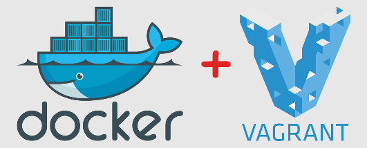
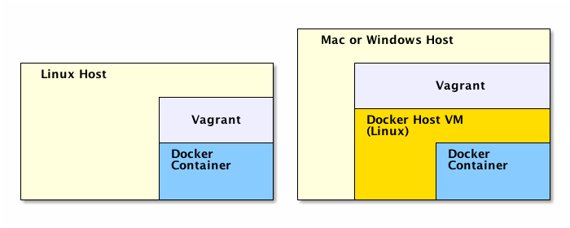
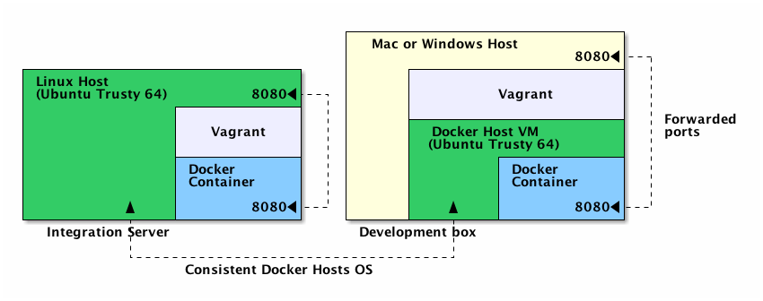
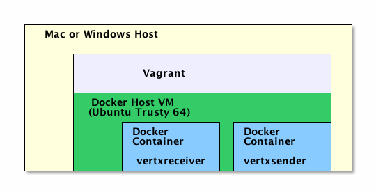

# Setting up a development environment using Docker and Vagrant

Often considered two alternative tools, Docker and Vagrant can be used together to build isolated and repeatable development environments. To prove it we will setup a simple Docker-only environment and then use Vagrant to make it portable on Mac and Windows platforms and solve real life issues.

FOR THE IMPATIENT: Jump to section *Using vagrant to make docker containers portable* if you just want to try out Docker with Vagrant and are not interested about common flaws of development environments, the setup of a simple Docker environment and the benefits of a Vagrant+Docker configuration.

## What's wrong with development environments?

* __It can take too long to set them up__
 
   How long does it takes for a new developer to setup your current project's development environment? The answer may depends on many factors (the project age, the number of developers that have worked on it, etc...) but half a day or more is not an uncommon one.
   
   Hey! It should be much faster than that: checkout a script and execute it. That's all. Two steps should be sufficient to setup your environment and get ready for development.

* __They can differ too much from CI, staging and production environments__

    Have you ever skipped your build's automated tests because they failed on your machine? Or even worst, have you ever been the cause of a build break even if your changes compiled smoothly on your machine because they failed consistently on CI server?

    Any slight difference can result in an unexpected behaviour. Diverging can be as simple as giving a try to the last version of a framework or switching to a different project for half a day. 
    
    Finding out what makes your system behave differently is an annoying task every developer should avoid.
    
## Virtual environments and Docker

As a consequence development environment should have two characteristics:
 
__Isolated__: you don't want to mess it up when testing some new tool or a different project.   
__Repeatable__: the same environment should be consistently reproducible on every team member machine and on CI and production servers.

Virtual environments ensure these features. But classic VMs are resource consuming. Developers need to code/build/test every few minutes and won't accept the virtualization overhead. 

Here is where [Docker](https://www.docker.com/) becomes helpful. Its lightweight containers are extremely fast compared to classic VMs and have become extremely popular among developers. Here is an excerpt from the Docker blog that explains the reasons for this success: 

> In its first 12 months Docker usage rapidly spread among startups and early adopters who valued the platform’s ability to separate the concerns of application development management from those of infrastructure provisioning, configuration, and operations.  Docker gave these early users a new, faster way to build distributed apps as well as a “write once, run anywhere” choice of deployment from laptops to bare metal to VMs to private and public clouds.

## Using Docker to configure an isolated and repeatable development environment

As an example we are going to setup a Docker container that can build and test a [Vert.x](http://vertx.io/) HTTP server. 

Vert.x is a lightweight application framework that encourages architectures of small, independent micro-services. A micro-service is "just a little stand-alone executable that communicates with other stand-alone executables" [(Uncle Bob)](http://blog.cleancoder.com/uncle-bob/2014/09/19/MicroServicesAndJars.html). We think it fits perfectly in a Docker container and that is why we choose it as an example here. 

If you haven't already installed Docker do it first. You can refer to the [official doc](https://docs.docker.com/installation/) or use [get docker script](https://get.docker.io/) to install it. We assume in this section that we are running on Linux. Even if Docker can be installed on Windows and Mac too (with boot2docker), we are going to see in the next session how to do that using Vagrant and why it can be a better choice.

### Dockerfile

To describe a container we need a Dockerfile:

    FROM ubuntu:14.04

    # Install dev tools: jdk, git etc...
    RUN apt-get update
    RUN apt-get install -y openjdk-7-jdk git wget

    # jdk7 is the default jdk
    RUN ln -fs /usr/lib/jvm/java-7-openjdk-amd64/jre/bin/java /etc/alternatives/java

    # Install vertx
    RUN \
      mkdir -p /usr/local/vertx && cd /usr/local/vertx && \
      wget http://dl.bintray.com/vertx/downloads/vert.x-2.1.2.tar.gz -qO - | tar -xz

    # Add vertx to the path
    ENV PATH /usr/local/vertx/vert.x-2.1.2/bin:$PATH

    RUN mkdir -p /usr/local/src
    WORKDIR /usr/local/src

    CMD ["bash"]

Dockerfiles are really straightforward. The reference can be found [here](https://docs.docker.com/reference/builder/).

`FROM ubuntu:14.04` defines the base image which we rely on. You can find a comprehensive list of Docker base images at the [docker hub](https://registry.hub.docker.com/). For this example we use the one used by the [docker team](https://github.com/docker/docker/blob/master/Dockerfile) to build Docker.

Subsequent lines describe modifications that will be applied on top of the base image:

* Install of development tools using apt-get: openjdk, git, wget
* Download and install vertx
* Add vertx bin folder to the path
* Create folder /usr/local/src and make it the default working directory

Once we have copied the Dockerfile we can build the Docker image:
	
	$ sudo docker build -t=vertxdev .

### Get the source code

The image we just built has git installed. We can use it to fetch the source code from Github:

	$ sudo docker run -t --rm -v /src/vertx/:/usr/local/src vertxdev git clone https://github.com/vert-x/vertx-examples.git
	
Note that git is run inside the container and the source code is therefore transferred there (in folder /usr/local/src precisely). To make the code persist, even after the container has been stopped and removed, we bind mount container's folder /usr/local/src to host folder /src/vertx using flag `-v /src/vertx/:/usr/local/src`. Whereas '--rm' destroy the container as soon as the `git clone` command has completed its execution.

### Build and run the application

Now that the source code has been fetched we will spin up a new container that builds and runs a vertx sample: HelloWorldServer. Beware that `vertx run` both builds and executes the vertx application.
    
    $ sudo docker run -d -v /src/vertx/:/usr/local/src -p 8080:8080 vertxdev vertx run vertx-examples/src/raw/java/httphelloworld/HelloWorldServer.java
    
In opposition the previous container this one won't be destroyed when it stops, expose port 8080 `-p 8080:8080` and is run in background `-d`. To have a look at `vertx run` output:
   
    $ sudo docker logs
    Succeeded in deploying verticle

Let's test the application from the host using curl:

	$ curl localhost:8080
	Hello World
	
This simple example should be sufficient to point out how fast it is to run a Docker container. The overhead of running `git clone` and `vertx run` inside a Docker container is unperceivable.

But this was a elementary environment to setup. In real life environments a Docker-only configuration has some shortcomings Vagrant can help to address.

## Docker + Vagrant

Docker (actually [libcontainer](https://github.com/docker/libcontainer) which is a Docker module) still requires Linux kernel 3.8 or higher and x86_64 architecture. This bounds considerably the environments Docker can natively run on. 

Vagrant is an open-source software that provides a method for creating repeatable development environments across a range of operating systems. Vagrant uses providers to spin up isolated virtual environments. The default provider is Virtualbox and since v1.6 [docker-based development environment](http://www.vagrantup.com/blog/vagrant-1-6.html#features) are supported too. Compared to other tools that can help running Docker on non Linux platforms (e.g.  boot2docker), Vagrant has some important advantages:

* On systems that don't supports Linux containers natively Vagrant automatically spins up a "host VM" to run Docker. On systems that support it natively Vagrant just spins up a Docker container. That's transparent for users.
* Docker hosts are not limited to boot2docker (Virtualbox [Tiny Core Linux](http://distro.ibiblio.org/tinycorelinux/) image). Debian, Ubuntu, CoreOS and other Linux distos are supported too. And VM engines others than Virtualbox are supported (e.g. VMWare).
* Vagrant can orchestrate Docker containers: run multiple containers concurrently and link them together

In the next three sections we will cover each of these points. 

## Using vagrant to make Docker containers portable

Vagrant supports Docker both as [provider](https://docs.vagrantup.com/v2/providers/index.html) that as [provisioner](https://docs.vagrantup.com/v2/provisioning/). But to let it automatically spin up a Docker host VM on Windows and Mac it should be used as a provider.

We are going to reuse the same Dockerfile we saw above. And, as above, we will run two Docker containers to execute `git clone` and `vertx run`. But Vagrant commands will used instead of Docker's.

Install [Vagrant](https://www.vagrantup.com/downloads) and [Virtualbox](https://www.virtualbox.org/wiki/Downloads) to be able to run the samples.

### Vagrantfile

Vagrantfiles describe Vagrant boxes. We will use the following one along this section:

	ENV['VAGRANT_DEFAULT_PROVIDER'] = 'docker'
		
	Vagrant.configure("2") do |config|
	  config.vm.define "vertxdev" do |a|
	    a.vm.provider "docker" do |d|
	      d.build_dir = "."
	      d.build_args = ["-t=vertxdev"]
	      d.ports = ["8080:8080"]
	      d.name = "vertxdev"
	      d.remains_running = true
	      d.cmd = ["vertx", "run", "vertx-examples/src/raw/java/httphelloworld/HelloWorldServer.java"]
	      d.volumes = ["/src/vertx/:/usr/local/src"]
	    end
	  end
	end

`ENV['VAGRANT_DEFAULT_PROVIDER'] = 'docker'` saves us to specify, at every Vagrant command, that the provider is Docker (default provider is Virtualbox). The rest of the file has options that Vagrant will use to build the Docker image and run a container.
For more information refer to [Vagrantfile][https://docs.vagrantup.com/v2/vagrantfile/index.html) and [Docker provider](https://docs.vagrantup.com/v2/docker/configuration.html) documentation.

### Get the source code

Once we have copied the Vagrantfile in Dockerfile folder we can run `git clone` to fetch the source code:

    $ vagrant docker-run vertxdev -- git clone https://github.com/vert-x/vertx-examples.git

Like before, the container will be destroyed when `git clone` ends its execution. Note that we haven't built the image, Vagrant did it automatically. On manual step less.

### Build and run the application

We are able to build and run the HTTP Hello World server:
    
    $ vagrant up

Under the hoods Vagrant will execute `docker run` and the command to start the container is specified by the `d.cmd` option.

To get the output of the `vertx run` command: 
    
    $ vagrant docker-logs    
    ==> vertxdev: Succeeded in deploying verticle
    
### Testing

On a linux platform just run:

	$ curl localhost:8080
	Hello World
	
On Windows and Mac port 8080 is not forwarded from Docker host VM to the main vagrant host (although Docker container port is forwarded to Docker host). As a consequence we need to ssh into Docker host VM to connect to the HTTP server. Let's retrieve the id of Vagrant default Docker host:

    $ vagrant global-status
    id       name     provider   state   directory                                                         
    -------------------------------------------------------------------------------------------------------
    c62a174  default  virtualbox running /Users/mariolet/.vagrant.d/data/docker-host
    
Once the box id retrieved we can test the HTTP server:
     
    $ vagrant ssh c62a174 -c "curl localhost:8080"
    Hello World
    
## Haven't you said identical? How to customise the Docker host

On platforms that don't support containers, by default Vagrant spins up a Tiny Core Linux (boot2docker) Docker host. If our CI, staging or production environment don't run boot2docker (hopefully) we have a gap between the configurations of these environments. That can virtually be the cause of a production bug, impossible to identify in developpment environment. Let's try to fix it.

As seen above, one of Vagrant main conveniences is that it let us specify a custom Docker host. In other words, we are not stucked with boot2docker and TCL.

### Docker host VM Vagrantfile

We will use a new Vagrantfile to define the Docker host VM. The following one is based on Ubuntu Server 14.04 LTS:

    Vagrant.configure("2") do |config|

      config.vm.provision "docker"

      # The following line terminates all ssh connections. Therfore
      # Vagrant will be forced to recconnect.
      # That's a workaround to have the docker command in the PATH
      config.vm.provision "shell", inline:
        "ps aux | grep 'sshd:' | awk '{print $2}' | xargs kill"
          
      config.vm.define "dockerhost"
      config.vm.box = "ubuntu/trusty64"
      config.vm.network "forwarded_port",
        guest: 8080, host: 8080

      config.vm.provider :virtualbox do |vb|
          vb.name = "dockerhost"
      end

    end

Save it in the original Vagrantfile folder with name DockerHostVagrantfile.

### Run Docker containers in a custom Docker host 

Next specify to use this new VM as Docker host instead of the default one adding two new lines to the `a.vm.provider` block:

      config.vm.define "vertxdev" do |a|
        a.vm.provider "docker" do |d|
          [...]
          d.vagrant_machine = "dockerhost"
          d.vagrant_vagrantfile = "./DockerHostVagrantfile"
        end
      end

Note that that configuring a custom docker host has another benefit: we can now specify custom forwarded ports:

    config.vm.network "forwarded_port",
            guest: 8080, host: 8080

As a result we are able to access the vertx HTTP server from within the main host OS:

 

Of course host VMs are not limited to Ubuntu. More vagrant boxes can be found on [Vagrant Cloud](https://vagrantcloud.com). Interesting Docker-enabled boxes are hosts are boot2docker ([original](https://vagrantcloud.com/mitchellh/boxes/boot2docker) and [improved](https://vagrantcloud.com/yungsang/boxes/boot2docker)) and [CoresOS](https://vagrantcloud.com/yungsang/boxes/coreos).

## Orchestrating Docker containers using Vagrant

Until now we have run one Docker container at a time. In real life however we often need to run multiple containers at the same time : database, http, web container etc...will all run in separate containers.  

In this section we deal with the simultaneous execution of multiple docker containers using Vagrant ["multi-machine" environment](https://docs.vagrantup.com/v2/multi-machine/). However we won't consider the scenario of Docker containers distributed in distinct Docker hosts: all containers run in the same host.  

### Running multiple containers

 

As a first example we will use Vert.x [Event Bus Point to Point example](https://github.com/vert-x/vertx-examples/tree/master/src/raw/java/eventbus_pointtopoint). We exploit the same Dockerfile we defined at the beginning and configure two Docker containers within a new Vagrantfile: "vertxreceiver" and "vertxsender":

    ENV['VAGRANT_DEFAULT_PROVIDER'] = 'docker'
    DOCKER_HOST_NAME = "dockerhost"
    DOCKER_HOST_VAGRANTFILE = "./DockerHostVagrantfile"

    Vagrant.configure("2") do |config|

      config.vm.define "vertxreceiver" do |a|
        a.vm.provider "docker" do |d|
          d.build_dir = "."
          d.build_args = ["-t=vertxreceiver"]
          d.name = "vertxreceiver"
          d.remains_running = true
          d.cmd = ["vertx", "run", "vertx-examples/src/raw/java/eventbus_pointtopoint/Receiver.java","-cluster"]
          d.volumes = ["/src/vertx/:/usr/local/src"]
          d.vagrant_machine = "#{DOCKER_HOST_NAME}"
          d.vagrant_vagrantfile = "#{DOCKER_HOST_VAGRANTFILE}"
        end
      end

      config.vm.define "vertxsender" do |a|
        a.vm.provider "docker" do |d|
          d.build_dir = "."
          d.build_args = ["-t=vertxsender"]
          d.name = "vertxsender"
          d.remains_running = true
          d.cmd = ["vertx", "run", "vertx-examples/src/raw/java/eventbus_pointtopoint/Sender.java","-cluster"]
          d.volumes = ["/src/vertx/:/usr/local/src"]
          d.vagrant_machine = "#{DOCKER_HOST_NAME}"
          d.vagrant_vagrantfile = "#{DOCKER_HOST_VAGRANTFILE}"
        end
      end

    end        

For both docker containers, `vagrant_mahchine`, the id of the Docker host VM, is `dockerhost`. Vagrant will be smart enough to reuse the same instance of `dockerhost` to run both containers.    

To start vertxsender and vertxreceiver replace the Vagrantfile with this one and run `vagrant up`: 

    $ vagrant up
    ...
    $ vagrant docker-logs
    ==> vertxsender: Starting clustering... 
	==> vertxsender: No cluster-host specified so using address 172.17.0.18 
	==> vertxsender: Succeeded in deploying verticle
	==> vertxreceiver: Starting clustering... 
    ==> vertxreceiver: No cluster-host specified so using address 172.17.0.19 
    ==> vertxreceiver: Succeeded in deploying verticle 
    ==> vertxreceiver: Received message: ping!
    ==> vertxsender: Received reply: pong
    ==> vertxreceiver: Received message: ping!
    ==> vertxreceiver: Received message: ping!
    ==> vertxsender: Received reply: pong
    ==> vertxsender: Received reply: pong
    ...

Even if vertxsender and vertxreceiver had no knowledge of each other hostname and IP address, the vertx eventbus protocol has a discovering capability that let connect senders and receivers. For applications that don't have a similar feature, Docker provide a [container linking option](https://docs.docker.com/userguide/dockerlinks/).  

### Linking containers

In this example we first run a Docker container (vertxdev) that starts up the HelloWorld web server we saw previously. Then a second container (vertxdev-client) will do an HTTP request using `wget`:

    ENV['VAGRANT_DEFAULT_PROVIDER'] = 'docker'

    Vagrant.configure("2") do |config|

      config.vm.define "vertxdev" do |a|
        a.vm.provider "docker" do |d|
          d.image = "vertxdev:latest"
          d.ports = ["8080:8080"]
          d.name = "vertxdev"
          d.remains_running = true
          d.cmd = ["vertx", "run", "vertx-examples/src/raw/java/httphelloworld/HelloWorldServer.java"]
          d.volumes = ["/src/vertx/:/usr/local/src"]
          d.vagrant_machine = "dockerhost"
          d.vagrant_vagrantfile = "./DockerHostVagrantfile"
        end
      end

      config.vm.define "vertxdev-client" do |a|
        a.vm.provider "docker" do |d|
          d.image = "vertxdev:latest"
          d.name = "vertxdev-client"
          d.link("vertxdev:vertxdev")
          d.remains_running = false
          d.cmd = ["wget","-qO", "-","--save-headers","http://vertxdev:8080"]
          d.vagrant_machine = "dockerhost"
          d.vagrant_vagrantfile = "./DockerHostVagrantfile"
        end
      end

    end

The important part of this new Vagrantfile is the line `d.link("vertxdev:vertxdev")`. Thanks to it, vertxdev-client will be able to resolve the hostname `vertxdev` and therefore fulfil the HTTP request using the command `wget -qO - --save-headers http://vertxdev:8080`.

To run the containers replace the Vagrantfile with this new one and run `vagrant up`. The `--no-parallel` option ensure that vertxdev container is started before vertxdev-client.  

    $ vagrant up --no-parallel

Have a look at logs to verify what happened:
    
    $ vagrant docker-logs
    ==> vertxdev: Succeeded in deploying verticle 
    ==> vertxdev-client: HTTP/1.1 200 OK
    ==> vertxdev-client: Content-Type: text/plain
    ==> vertxdev-client: Content-Length: 11
    ==> vertxdev-client: 
    ==> vertxdev-client: Hello World
    
## Dude where is my IDE?

Although IDEs are an important part of a development environments we haven't talked about it yet. That's because graphical application aren't usually run in Docker containers. IDE as Eclipse or IntelliJ find their natural habitat in the main host with source code shared between the host and the containers using Docker volumes. That's what this section is about.

Vagrant comes with a `synced_folder` option to share folders between the docker container and the main host:

	ENV['VAGRANT_DEFAULT_PROVIDER'] = 'docker'
	
	Vagrant.configure("2") do |config|
	
	  config.vm.synced_folder ".", "/usr/local/src"
	  
	  config.vm.define "vertxdev-src" do |a|
	    a.vm.provider "docker" do |d|
	      d.build_dir = "."
	      d.build_args = ["-t=vertxdev"]
	      d.ports = ["8080:8080"]
	      d.name = "vertxdev-src"
	      d.remains_running = true
	      d.cmd = ["vertx", "run", "vertx-examples/src/raw/java/httphelloworld/HelloWorldServer.java"]
	      d.vagrant_machine = "dockerhost"
	      d.vagrant_vagrantfile = "./DockerHostVagrantfile"
	    end
	  end
	
	end

In this example vertxdev-src folder `/usr/local/src` will be synced with main host Vagrantfile folder (`.`). Note that Vagrant take care of creating a Docker volume for us. 
    
Once we have replaced the Vagrantfile with this one we can `git clone` again using vertxdev-src container: 
    
    $ vagrant docker-run vertxdev-src -- git clone https://github.com/vert-x/vertx-examples.git

Once cloned, the source code will be available in both the container and the main host. Therefore we have direct access and can edit files:
	
	$ cd vertx-examples/src/raw/java/httphelloworld/
	$ sed -i '' 's/Hello World/I m in a docker container and I feel good/' HelloWorldServer.java	
    
To test the application run `vagrant up`:

	$ cd -
	$ vagrant up
	$ curl localhost:8080
	I m in a docker container and I feel good

## Conclusion

Using Vagrant to control Docker containers can be useful if dealing with a mix of different platforms: some Docker-enabled and others not. In this scenario using Vagrant makes the process of setting up an environment consistent across different platforms.

As an alternative to Vagrant, [Fig](http://www.fig.sh/) is certainly worth checking out. Docker has has hired its main developer and [is strongly supporting it](https://blog.docker.com/tag/fig/) as to tool to setup Docker based development environments.